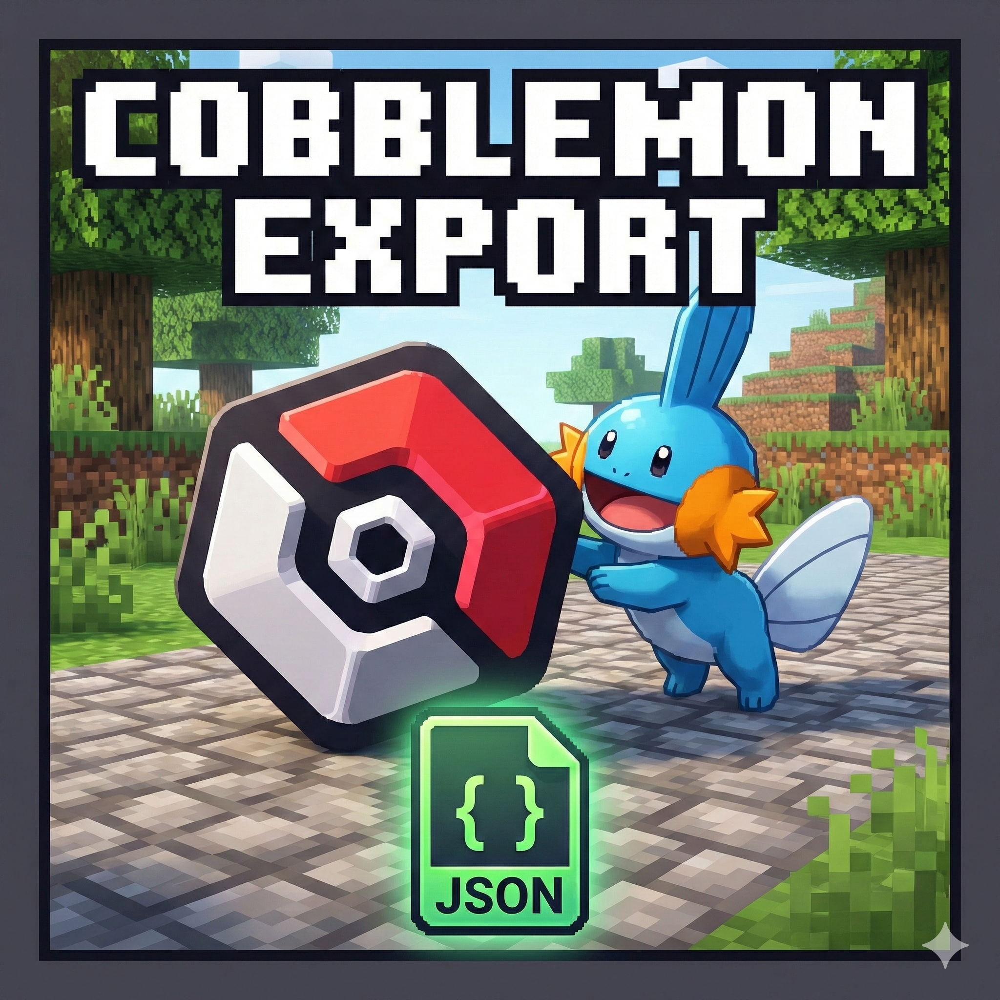

# Cobblemon Export

<p align="center">
  
</p>

<p align="center">
    <b>Export your Pokémon data to JSON effortlessly.</b>
    <br>
    <a href="LICENSE">MIT License</a> | <a href="#">Fabric 1.21.1</a> | <a href="#">Client-Side</a>
</p>

---

## 👋 Introduction

Hello! This mod was made by **AlguemDaRua**.

I created this small utility because I wanted to access detailed information about my Pokémon (IVs, EVs, Stats, Moves) without having to check them one by one in the summary screen. Whether you are building a competitive team, trading with friends, or backing up your data, **Cobblemon Export** makes it instant and easy.

I hope you like it and enjoy using it! Please leave feedback so I can make it even better.

## ✨ Features

*   **Export Party:** Instantly dump your current team's data to a file.
*   **Export PC Boxes:** Export entire boxes (up to box 200) with a single command. **NOTE: Not all boxes at one, right now**
*   **Detailed JSON:** The output includes UUIDs, Species, Stats, IVs, EVs, Moves, Nature, Ability, and more.
*   **Two Modes:**
    *   **Overwrite:** Keep a single clean file (e.g., `party_export.json`).
    *   **New/Snapshot:** Create history files (e.g., `party_export_1.json`, `party_export_2.json`).
*   **Click-to-Open:** Once exported, click the filename in the chat to instantly open the file on your computer!
*   **Client-Side Only:** Works on multiplayer servers without needing to be installed on the server.

## 🛠️ Dependencies & Versions

To run this mod, you need the following:

| Component | Version Requirement |
| :--- | :--- |
| **Minecraft** | `1.21.1` |
| **Fabric Loader** | `0.18.2` or higher |
| **Fabric API** | Required |
| **Cobblemon** | `1.7` or higher |

## 💻 Commands

All commands start with `/cobble_export`. You can also use the in-game help menu by typing `/cobble_export help`.

### 1. Export Party
Exports the 6 Pokémon currently in your team.
```mcfunction
# Overwrites 'party_export.json'
/cobble_export party

# Creates a new file (e.g., 'party_export_1.json')
/cobble_export party new
```

### 2. Export PC Box
Exports all Pokémon in a specific PC box.
```mcfunction
# Exports Box 1 to 'box_1_export.json'
/cobble_export box 1

# Exports Box 5 to a new numbered file
/cobble_export box 5 new
```

---

## ⚠️ Important Note for PC Export

Since this is a **Client-Side Mod**, your game client does not know what is inside your PC Storage until you open the PC block.

> **If you get an error saying "PC Storage not found":**
> 1. Place a PC block in-game.
> 2. Open it once.
> 3. Close it.
> 4. Run the command again.

This caches the box data to your client so the mod can read it!

---

## 📂 Output Format

Files are saved in your Minecraft folder at:
`/.minecraft/cobblemon_exports/`

**Example JSON Output:**
```json
[
  {
    "species": "mudkip",
    "nickname": "Mudkip",
    "level": 10,
    "shiny": false,
    "gender": "MALE",
    "ability": "torrent",
    "nature": "adamant",
    "stats": {
      "hp": 30,
      "atk": 18,
      "def": 12,
      "spa": 10,
      "spd": 12,
      "spe": 14
    },
    "ivs": {
      "hp": 31,
      "atk": 31,
      "def": 20,
      "spa": 5,
      "spd": 25,
      "spe": 31
    },
    "moves": [
      "tackle",
      "growl",
      "water_gun"
    ]
  }
]
```

## 📥 Installation

1.  Download the **`.jar`** file.
2.  Make sure you have **Fabric Loader** installed for Minecraft 1.21.1.
3.  Place the `.jar` into your `mods` folder.
4.  Launch the game!

## 📜 License

This project is licensed under the **MIT License**.
Copyright © 2026 **AlguemDaRua**.

You are free to use, modify, and distribute this mod as long as credit is provided.
